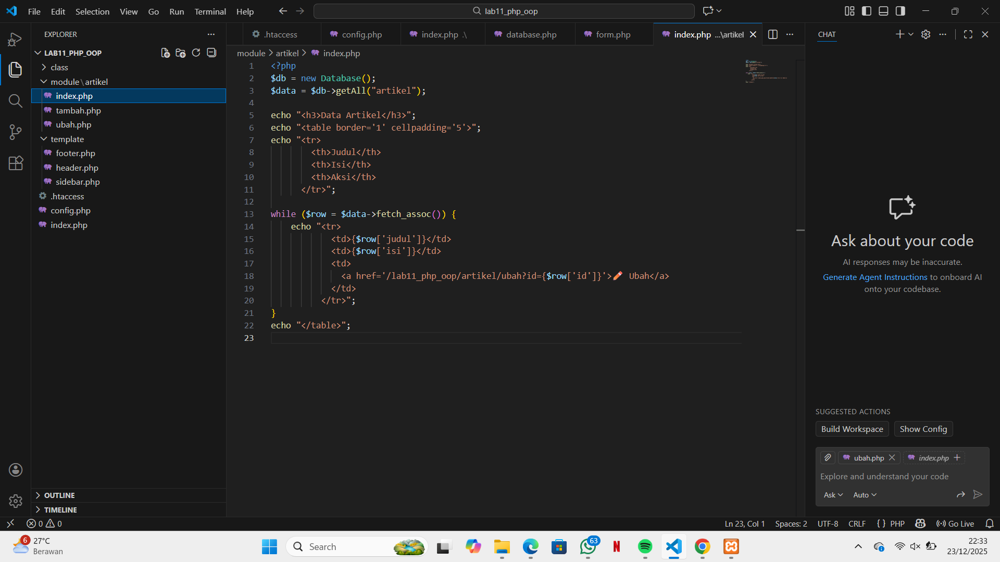
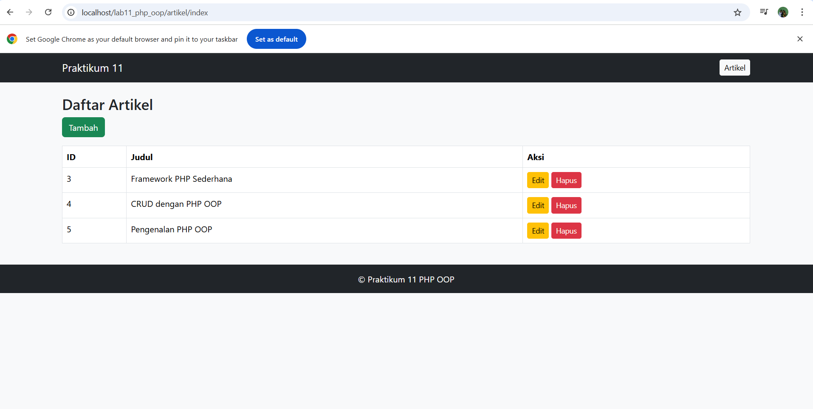
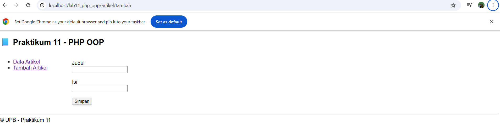
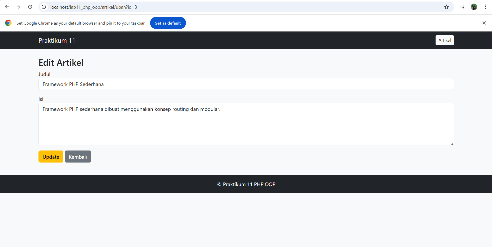
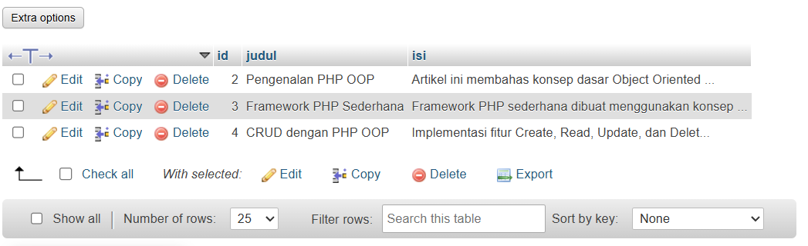

# Praktikum 11 – PHP OOP (Framework Sederhana)

## Identitas
- Nama : Razy Al Farisi  
- NIM  : (isi NIM)  
- Prodi : Teknik Informatika  
- Universitas : Universitas Pelita Bangsa  

---

## Pendahuluan
Praktikum 11 membahas penerapan konsep **Object Oriented Programming (OOP)** pada PHP dengan membangun framework sederhana berbasis **routing** dan **struktur modular**.  
Aplikasi ini dibuat untuk memahami pemisahan logika program, tampilan, dan pengelolaan database.

---

## Tujuan
1. Menerapkan konsep OOP pada PHP  
2. Menggunakan routing dengan `.htaccess`  
3. Membuat struktur folder modular  
4. Mengimplementasikan CRUD menggunakan database MySQL  

---

## Teknologi
- PHP  
- MySQL  
- Apache (XAMPP)  
- Bootstrap  
- CSS  

---

## Struktur Folder Project
Menampilkan struktur folder aplikasi yang menunjukkan penerapan konsep modular.

---

## Cara Menjalankan Aplikasi
1. Jalankan Apache dan MySQL melalui XAMPP  
2. Simpan folder project ke dalam direktori `htdocs`  
3. Buat database `latihan_oop` di phpMyAdmin  
4. Buat tabel `artikel` sesuai struktur  
5. Akses aplikasi melalui browser  

---

## Dokumentasi Aplikasi

### 1. Halaman Daftar Artikel
Menampilkan seluruh data artikel yang tersimpan di dalam database.

---

### 2. Halaman Tambah Artikel
Digunakan untuk menambahkan data artikel baru ke dalam database melalui form input.

---

### 3. Halaman Edit Artikel
Digunakan untuk mengubah data artikel yang telah tersimpan di dalam database.

---

### 4. Database Artikel
Menampilkan data artikel pada database `latihan_oop` melalui phpMyAdmin.

---

## Kesimpulan
Dengan dibuatnya aplikasi ini, dapat disimpulkan bahwa penerapan konsep OOP dan struktur modular pada PHP dapat membantu pengembangan aplikasi web menjadi lebih terstruktur, rapi, dan mudah dikembangkan.

---

© Praktikum 11 PHP OOP
